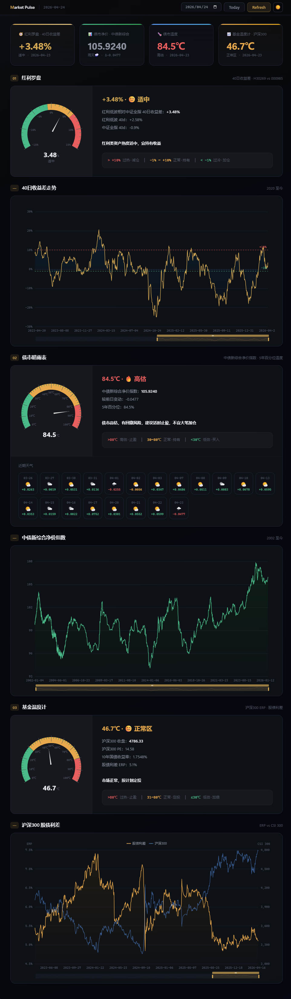
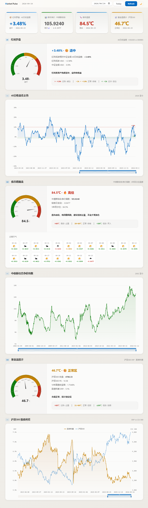
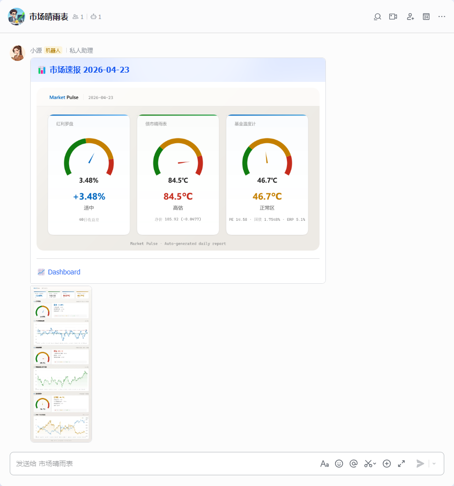

# Market Pulse

[](https://github.com/Hxyspace/MarketPulse/releases)


[](./LICENSE)
[](https://github.com/Hxyspace/MarketPulse/actions/workflows/build.yml)

量化市场监控面板 — 三大核心指标 + 飞书每日推送 + 异常加急提醒。

## 🎯 功能模块

| 模块 | 指标 | 判断逻辑 | 数据源 |
|------|------|---------|--------|
| **红利罗盘** | 红利低波 vs 中证全指 40 日收益差 | > +10% 过热 · -1%~+10% 正常 · < -1% 过冷 | 中证指数 + 腾讯财经 |
| **债市晴雨表** | 中债新综合净价指数 5 年百分位温度 | > 80℃ 高估 · 30~80℃ 适中 · < 30℃ 低估 | 中国债券信息网 |
| **基金温度计** | 沪深 300 股债利差 (ERP) 10 年百分位 | > 80℃ 高温 · 30~80℃ 正常 · < 30℃ 低温 | 中证指数 + 中国债券信息网 |

## 📸 截图

### Web 面板

> 访问 `http://localhost:3000`，支持亮/暗主题切换，仪表盘 + 历史走势图 + 日期查询。

| Dark | Light |
|------|-------|
|  |  |

### 飞书推送

每个交易日定时推送：

1. **速报卡片** — 仪表盘 + 关键指标
2. **全景仪表盘** — 含完整历史走势图

状态变化时自动触发 **飞书加急推送**。



## 🚀 快速开始

## 📦 安装

### 方式一：从 Release 安装（推荐）

从 [GitHub Releases](https://github.com/Hxyspace/MarketPulse/releases) 下载最新的 `.tgz` 文件：

```bash
npm install -g market-pulse-<version>.tgz

# 配置飞书推送（可选，通过环境变量）
export FEISHU_APP_ID=cli_xxxx
export FEISHU_APP_SECRET=xxxx
export FEISHU_CHAT_ID=oc_xxxx

# 启动
market-pulse
```

### 方式二：从源码安装

```bash
git clone https://github.com/Hxyspace/MarketPulse.git
cd MarketPulse
npm install
```

### 系统依赖

node-canvas 需要 Cairo 原生库：

```bash
# Ubuntu / Debian
sudo apt-get install -y build-essential libcairo2-dev libjpeg-dev libpango1.0-dev libgif-dev librsvg2-dev

# macOS
brew install pkg-config cairo pango libpng jpeg giflib librsvg

# Windows — npm install 自动下载预编译二进制，无需额外安装
```

### 运行

```bash
# 开发模式（热重载）
npm run dev

# 生产构建
npm run build
npm start
```

启动后访问 http://localhost:3000 — 日志中会打印局域网 LAN 地址。

## 🔔 飞书推送配置

<details>
<summary>展开配置步骤</summary>

1. 在 [飞书开放平台](https://open.feishu.cn/app) 创建企业自建应用，开启 **机器人** 能力
2. 复制 `.env.example` 为 `.env`，填入凭证：

```bash
FEISHU_APP_ID=cli_xxxx           # App ID
FEISHU_APP_SECRET=xxxx            # App Secret
FEISHU_CHAT_ID=oc_xxxx            # 目标群聊 chat_id
FEISHU_URGENT_OPEN_ID=ou_xxxx     # 加急推送目标用户 open_id（可选）
```

3. 确保机器人已加入目标群聊
4. 所需权限：

| 权限 | 说明 |
|------|------|
| `im:message:send_as_bot` | 发送消息 |
| `im:resource` | 上传图片 |
| `im:message.urgent:app_urgent` | 应用内加急（可选） |

</details>

配置完成后，每个交易日 09:00（北京时间）自动推送。卡片内含「查看面板」按钮

**推送流程**：计算数据 → 生成图片 → 上传飞书 → 发送卡片 → 状态变化时加急推送

## 📁 项目结构

```
src/
├── config.ts                 # 集中配置
├── index.ts                  # Express 入口 + LAN IP 检测
├── routes/api.ts             # REST API
├── services/
│   ├── eastmoney.ts          # 指数数据（CSI 官方 + 腾讯财经）
│   ├── chinabond.ts          # 中债净价指数
│   ├── bondYield.ts          # 10 年国债收益率
│   ├── storage.ts            # JSON 文件存储
│   ├── feishu.ts             # 飞书推送
│   ├── reportImage.ts        # 速报卡片图片
│   └── dashboardImage.ts     # 全景仪表盘图片
├── calculators/
│   ├── dividendCompass.ts    # 红利罗盘
│   ├── bondBarometer.ts      # 债市晴雨表
│   └── fundThermometer.ts    # 基金温度计
├── cron/scheduler.ts         # 定时任务
├── public/index.html         # Web 面板
└── data/                     # 历史数据存储
```

## 🛠 技术栈

| 类别 | 技术 |
|------|------|
| 运行时 | Node.js + TypeScript |
| Web 框架 | Express |
| 图表 | ECharts |
| 图片生成 | node-canvas |
| 定时任务 | node-cron |
| 消息推送 | 飞书 Open API |
| 数据存储 | 本地 JSON 文件缓存 |

## 📊 数据源

| 数据 | 来源 | 说明 |
|------|------|------|
| 指数行情 | 中证指数官方 API | 红利低波、中证全指、沪深 300（含 PE） |
| 指数行情（备用） | 腾讯财经 API | 中证全指（无 PE） |
| 债券净价指数 | 中国债券信息网 | 中债新综合净价指数（2002 年至今） |
| 国债收益率 | 中国债券信息网 | 10 年期国债到期收益率（2010 年至今） |

**更新策略**：北京时间 18:00 前取前一交易日，之后取当天。每个交易日只拉取一次，增量更新。

## 🔧 CI

推送到 `main` 或打 `v*` tag 时触发 [GitHub Actions](.github/workflows/build.yml)：

```
type check → build → package → (tag 时) 发布 Release
```

## 📝 TODO

- [ ] 历史温度曲线
- [ ] 更多指数（中证 50、创业板等）
- [ ] 移动端适配
- [ ] 股息率数据接入

## 📄 License

[MIT License](./LICENSE)
